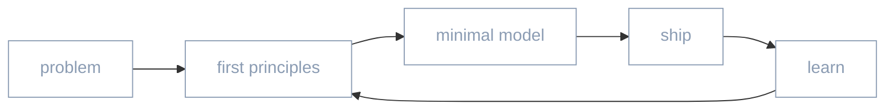

<!--
  Profile for https://github.com/sahajpatel123
  Minimal · interactive · easy to read
-->

<div align="center">

```
┌─────────────────────────────────────────┐
│  sahaj                                  │
│  student · builder · systems thinker    │
└─────────────────────────────────────────┘
```


<br/>

[](https://linkedin.com/in/sahajpatel1703)
[](mailto:patelsahaj01@icloud.com)
[](https://github.com/sahajpatel123)

</div>

---

I design and ship systems that **reason**, **trade**, and **simulate** —  
multi-agent AI, prediction markets, and computational models.

Quiet stack. Clear interfaces. End-to-end ownership.

---

### selected work

<table>
  <tr>
    <td width="50%" valign="top">
      <h3><a href="https://github.com/sahajpatel123/Multi-AI-Agents">Arena</a></h3>
      <p>Four agents answer in parallel. A fifth scores them. The best reply wins — then debate or focus any mind.</p>
      <p>
        <code>TypeScript</code> · <code>Next.js</code>
        · <a href="https://multi-ai-agents-chi.vercel.app">live</a>
      </p>
    </td>
    <td width="50%" valign="top">
      <h3><a href="https://github.com/sahajpatel123/Simulation">TheCee</a></h3>
      <p>10,000 simulated consumers across 52 psychographic clusters — pressure-test a startup idea before you build it.</p>
      <p>
        <code>Python</code> · <code>FastAPI</code>
        · <a href="https://simulation-iota.vercel.app">live</a>
      </p>
    </td>
  </tr>
  <tr>
    <td width="50%" valign="top">
      <h3><a href="https://github.com/sahajpatel123/cleardoc">ClearDoc</a></h3>
      <p>Paste a contract. Get plain English, the traps, a verdict, and what to do next.</p>
      <p>
        <code>JavaScript</code> · <code>Vercel</code>
        · <a href="https://cleardoc-seven.vercel.app">live</a>
      </p>
    </td>
    <td width="50%" valign="top">
      <h3><a href="https://github.com/sahajpatel123/cognitivesystem">Cognitive System</a></h3>
      <p>A thinking partner — structured reasoning underneath, human-aligned expression on top. Not a chatbot wrapper.</p>
      <p>
        <code>Python</code>
        · <a href="https://cognitivesystem.vercel.app">live</a>
      </p>
    </td>
  </tr>
  <tr>
    <td width="50%" valign="top">
      <h3><a href="https://github.com/sahajpatel123/polymarket">poly-maker</a></h3>
      <p>Maker-only market-making on Polymarket CLOB — fair value, inventory skew, toxicity-aware quoting.</p>
      <p><code>Python</code> · <code>async</code></p>
    </td>
    <td width="50%" valign="top">
      <h3><a href="https://github.com/sahajpatel123/conduraapp">Condura</a></h3>
      <p>Local-first OS-native AI conductor. One daemon for the tools already on your machine.</p>
      <p><code>Go</code> · <code>desktop</code></p>
    </td>
  </tr>
</table>

<details>
<summary><b>more projects</b></summary>
<br/>

| project | what it is |
|:--------|:-----------|
| [autonomous-trading-agent](https://github.com/sahajpatel123/autonomous-trading-agent) | Claude-brained Polymarket trader with risk gates |
| [llm](https://github.com/sahajpatel123/llm) | Minimal Next.js chat foundation (Postgres + Prisma) |
| [dispatch](https://github.com/sahajpatel123/dispatch) | Async job dispatch utilities |
| [ResearchGradeSystem](https://github.com/sahajpatel123/ResearchGradeSystem) | Evaluation harness for AI fidelity & reproducibility |

</details>

---

### how I think



---

### tools

<div align="center">

<a href="https://skillicons.dev">
  <picture>
    <source media="(prefers-color-scheme: dark)" srcset="https://skillicons.dev/icons?i=py,go,ts,js,nextjs,react,nodejs,fastapi,docker,postgres,git,vercel&theme=dark" />
    <source media="(prefers-color-scheme: light)" srcset="https://skillicons.dev/icons?i=py,go,ts,js,nextjs,react,nodejs,fastapi,docker,postgres,git,vercel&theme=light" />
    
  </picture>
</a>

</div>

---

### activity

<div align="center">

<picture>
  <source
    media="(prefers-color-scheme: dark)"
    srcset="https://raw.githubusercontent.com/sahajpatel123/sahajpatel123/output/github-contribution-grid-snake-dark.svg"
  />
  <source
    media="(prefers-color-scheme: light)"
    srcset="https://raw.githubusercontent.com/sahajpatel123/sahajpatel123/output/github-contribution-grid-snake.svg"
  />
  
</picture>

</div>

---

<div align="center">

**open to collaboration** on agents, markets, and systems that need to think.

[linkedin](https://linkedin.com/in/sahajpatel1703) · [email](mailto:patelsahaj01@icloud.com) · [repos](https://github.com/sahajpatel123?tab=repositories)

<br/>

<sub>build quietly. ship clearly.</sub>

</div>
